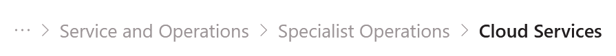
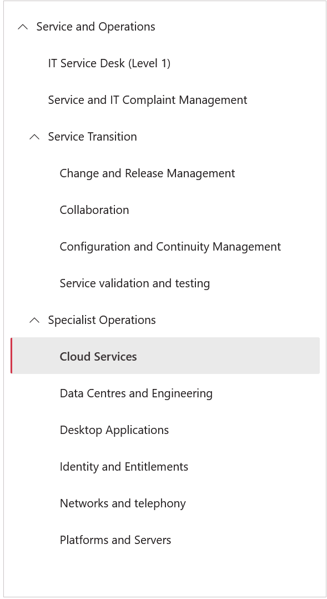
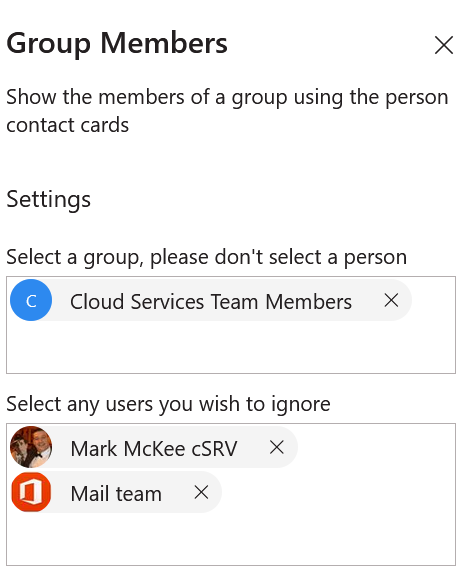
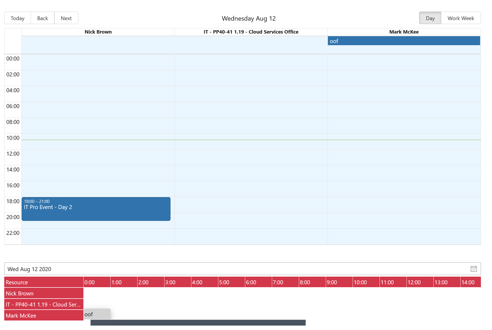

# cu-general-parts

## Summary

Collection of General Web Parts for use by Cardiff University mainly, these are generalised parts meaning they can be used outside of the Cardiff University SharePoint instance

Built using Typescript and mainly the [FluentUI](https://developer.microsoft.com/en-us/fluentui) framework

## Used SharePoint Framework Version

## Applies to

- [SharePoint Framework](https://aka.ms/spfx)
- [Microsoft 365 tenant](https://docs.microsoft.com/en-us/sharepoint/dev/spfx/set-up-your-developer-tenant)

> Get your own free development tenant by subscribing to [Microsoft 365 developer program](http://aka.ms/o365devprogram)

## Prerequisites

> [SharePoint Dev Environment](https://docs.microsoft.com/en-us/sharepoint/dev/spfx/set-up-your-development-environment)

## Version history

Version|Date|Comments
-------|----|--------
1.6.0.2|12/08/2020|Added sharepoint theme colours to Horizontal Resource View
1.6.0.0|12/08/2020|Added Horizontal Resource Calendar View
1.5.0.6|10/08/2020|Added support for selecting multiple groups in the group members control
1.5.0.0|07/08/2020|Added Group Members WebPart
1.4.0.12|06/08/2020|Added a sort to the Page Tree
1.3.0.5|30/07/2020|Added expand level for the Page Tree
1.3.0.0|29/07/2020|Added the Page Tree
1.0.0.0|20/07/2020|Started work on the General Webparts Collection - started with Resource Calendar

## Disclaimer

**THIS CODE IS PROVIDED *AS IS* WITHOUT WARRANTY OF ANY KIND, EITHER EXPRESS OR IMPLIED, INCLUDING ANY IMPLIED WARRANTIES OF FITNESS FOR A PARTICULAR PURPOSE, MERCHANTABILITY, OR NON-INFRINGEMENT.**

---

## Minimal Path to Awesome

- Clone this repository
- Ensure that you are at the solution folder
- in the command-line run:
  - **npm install**
  - **gulp serve --nobrowser**
  - **go to your sharepoint workbench**

## Features

### Page Navigation

There are two webparts contained in the page navigation collection, inserting either of these components into a webpage will expand the sharepoint site pages library with ParentID.

After you have installed the app and added one of the components to a page you will need to define the site structure, you do this by setting the ParentID property in the site pages view

1. Go to Site contents
1. Go to Site Pages
1. Change the View to App Pages
1. Click on Add column
1. Click on Show/hide columns
1. Tick ID and Parent
1. Click Apply
1. Click on Quick Edit
1. Set the Parent ID on the pages you want a structure for
1. Exit Quick Edit

You can then set the Root Page ID in the web part properties

#### Page Breadcrumbs

Displays a breadcrumb trail from the current page back to the root page (set in properties), uses the breadcrumb component of [FluentUI](http://developer.microsoft.com/fluentui) and [SharePoint REST API v1](https://docs.microsoft.com/en-us/sharepoint/dev/sp-add-ins/get-to-know-the-sharepoint-rest-service?tabs=csom)

#### Page Navigation Tree

Displays a tree structure of the page structure, with the current page selected.  Uses the tree component from [FluentUI](http://developer.microsoft.com/fluentui) and [SharePoint REST API v1](https://docs.microsoft.com/en-us/sharepoint/dev/sp-add-ins/get-to-know-the-sharepoint-rest-service?tabs=csom)

### Group Members

Displays a list of members of a group.  Renders using the default SharePoint contact cards and pulls data from the [Microsoft Graph](https://docs.microsoft.com/en-us/graph/api/overview?view=graph-rest-1.0).  Requires Group Members Read permission in SharePoint.  You can exclude users as well.

**Properties**

### Resource Calendar

Displays a combined calendar view with multiple fed calendars.  It has two view modes, horizontal and vertical (default).  Horizontal is a completely custom written view.

Uses [Microsoft Graph](https://docs.microsoft.com/en-us/graph/api/overview?view=graph-rest-1.0) to get the calendar or get the free/busy status information (depending on permissions).

## References

- [Getting started with SharePoint Framework](https://docs.microsoft.com/en-us/sharepoint/dev/spfx/set-up-your-developer-tenant)
- [Building for Microsoft teams](https://docs.microsoft.com/en-us/sharepoint/dev/spfx/build-for-teams-overview)
- [Use Microsoft Graph in your solution](https://docs.microsoft.com/en-us/sharepoint/dev/spfx/web-parts/get-started/using-microsoft-graph-apis)
- [Publish SharePoint Framework applications to the Marketplace](https://docs.microsoft.com/en-us/sharepoint/dev/spfx/publish-to-marketplace-overview)
- [Microsoft 365 Patterns and Practices](https://aka.ms/m365pnp) - Guidance, tooling, samples and open-source controls for your Microsoft 365 development
- [React-Big-Calendar](https://github.com/jquense/react-big-calendar/) - For the vertical resource calendar view
- [FluentUI](http://developer.microsoft.com/fluentui) - for most of the controls
- [PnP SPFx Property Controls](https://pnp.github.io/sp-dev-fx-property-controls/) - if it's already been made use what's already there.
- [Microsoft Graph API References](https://docs.microsoft.com/en-us/graph/api/overview?view=graph-rest-1.0)
- [SharePoint REST API v1](https://docs.microsoft.com/en-us/sharepoint/dev/sp-add-ins/get-to-know-the-sharepoint-rest-service?tabs=csom)